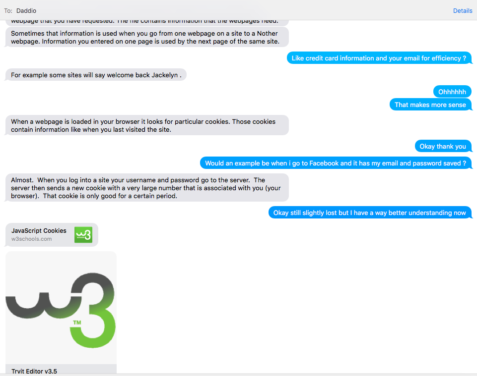
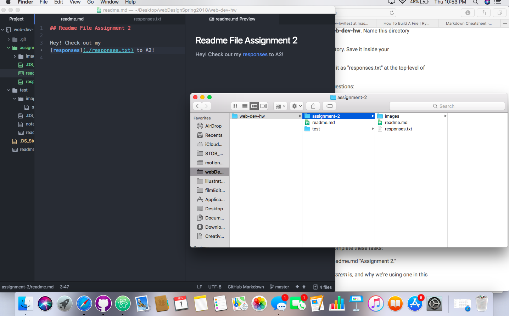

# Assignment 2

A Version Control System (VCS) is a system which allows a user or users to track the history of changes to their file. Each time a user 'commits' a new change in their file, an updated version of their changes appears. Because each version of the file is saved once committed, the developer has the opportunity to go back to a previous version in case of errors or preference. Version Control System's also allow for easier collaboration. Multiple team members are able to make changes to the same file, and when a changes or revision is approved, a tool is provided to merge the different versions back together to create a more useful, and collaborative file. Git specifically allows users to see who made what change and when, which helps us discover where the file went wrong or where it went right. All of these elements provided by a Version Control System are why *we* are using one for our class. Not only is it beneficial to see our modifications to a file and go back, but GitHub specifically allows for us to utilize their free hosted webspace, which is where we will submit our homework. Lastly, we as students are able to become familiar and comfortable with a system that is useful in our industry: GIT and GitHub.com will provide us with necessary experience to make us more well-rounded programmers, collaborators, etc.

#### My Experiences:
- This assignment was fairly easy for me to accomplish this week. I have had experience with GitHub and GIT from Dr. Musick's Creative Coding class, so I am fortunate in having some prior experience with setting up a repository.
- When y'all say 6 hours per week per class, you aren't messing around! Luckily I enjoy this type of work and I am excited to learn more about this field of study, so 6 hours is fine by me. I am grateful for the simplifying videos, as this kind of information is easy to confuse, but the videos did an excellent job at conveying it in an easy-to-understand manner.
- I'm beyond blessed to have a dad who works as a programmer/web developer/second teacher, so any questions I have I am able to ask him. The only downfall is I forget about the Issues Board as being a useful tool for me as well; I guess it's time to start leaning on my peers and classmates instead of my Daddio. However, one part I did have trouble with was understanding Cookies. Dad swept in and helped me clear up my confusion and provided me with more useful links and simpler terms.

- It's been hard to help others on the Issues Board as their fires are quickly put out (not complaining that is excellent). Typically when a new Issue is filed, I am at work and don't have time to reply right then, and when I do get a moment it's already been solved, so this is great!

For more information on what I learned this week, check out my [responses](./responses.txt) to A2!

