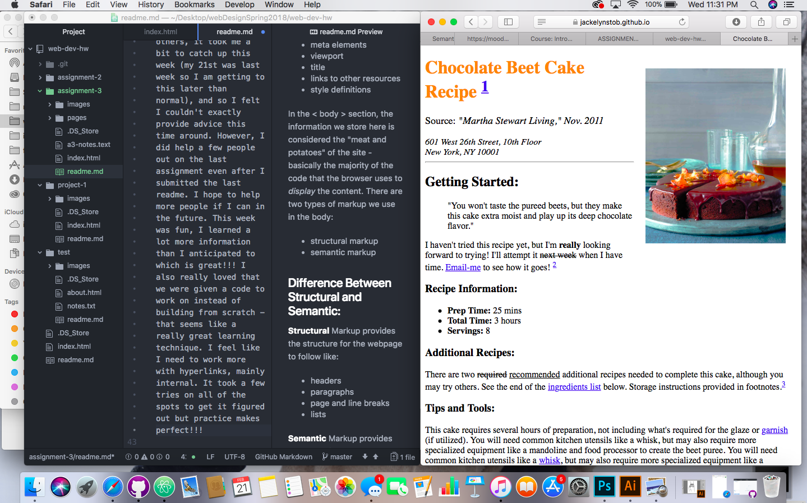

# I Dunno, Beets Me
## Jack Stob | Web Design
#### What's in a page?
HTML is a beautifully simple(ish) language used to help code webpages. The understandable 'setup' of a page is what really makes HTML an easy-to-learn language. At the top we have a <!DOCTYPE  html> to declare html5 as the language. Then we have
- < html >
- < head >
- < body >

Each of these sections are specific to a document and have a purpose. In the < head > section, we typically have the "meta data and information about the site, not visible to visitors". There are 5 elements we put inside of the head, and they are:
- meta elements
- viewport
- title
- links to other resources
- style definitions

In the < body > section, the information we store here is considered the "meat and potatoes" of the site - basically the majority of the code that the browser uses to *display* the content. There are two types of markup we use in the body:
- structural markup
- semantic markup

#### Difference Between Structural and Semantic:

**Structural** Markup provides the structure for the webpage to follow like:
- headers
- paragraphs
- page and line breaks
- lists

**Semantic** Markup provides the style of how we see certain words on the page:
- bold/strong
- italics/emphasis
- superscript/subscript
- quotes/blockquotes
- abbreviations/acronyms
- citations
- definitions
- addresses
- insert/delete
- strikethrough

#### How'd this week go?

For some reason the hardest part about this week was connecting a link to my assignment 3 on my original index.html we created to display our submissions. For some reason it was just not working: between typos and random logistics I finally figured it out. I think github was a little slow this week. As far as helping others, it took me a bit to catch up this week (my 21st was last week so I am getting to this later than normal), and so I felt I couldn't exactly provide advice this time around. However, I did help a few people out on the last assignment even after I submitted the last readme. I hope to help more people if I can in the future. This week was fun, I learned a lot more information than I anticipated to which is great!!! I also really loved that we were given a code to work on instead of building from scratch - that seems like a really great learning technique. I feel like I need to work more with hyperlinks, mainly internal. It took a few tries on all of the spots to get it figured out but practice makes perfect!!!

