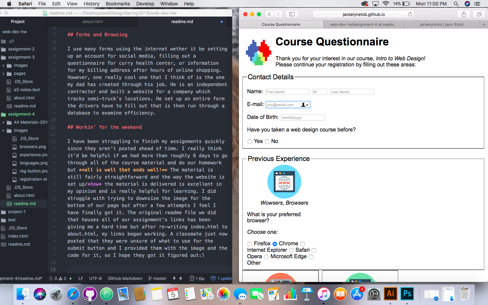

# You Have a Question? Well I Have an ANSWER

## That's like, so ALT-ternative to use Alt text

Alt text is used to describe what the image on a screen is for those that are impaired visually.

## Forms and Browsing

I use many forms using the internet wether it be setting up an account for social media, filling out a questionnaire for curry health center, or information for my billing address after hours of online shopping. However, one really cool one that I think of is the one my dad has created through his job. He is an independent contractor and built a website for a company which tracks semi-truck's locations. He set up an entire form the drivers have to fill out that is then run through a database to examine efficiency.

## Workin' for the weekend

- I have been struggling to finish my assignments quickly since they aren't posted ahead of time. I really think it'd be helpful if we had more than roughly 6 days to go through all of the course material and do our homework but **all is well that ends well!**
- The material is still fairly straightforward and the way the website is set up/*how* the material is delivered is excellent in my opinion and is really helpful for learning.
- I did struggle with trying to downsize the image for the bottom of our page but after a few attempts I feel I have finally got it.
- The original readme file we did that houses all of our assignment's links has been giving me a hard time but after re-writing index.html to about.html, my links began working.
- A classmate just now posted that they were unsure of what to use for the submit button and I provided them with the image and the code for it, so I hope they got it figured out:)

