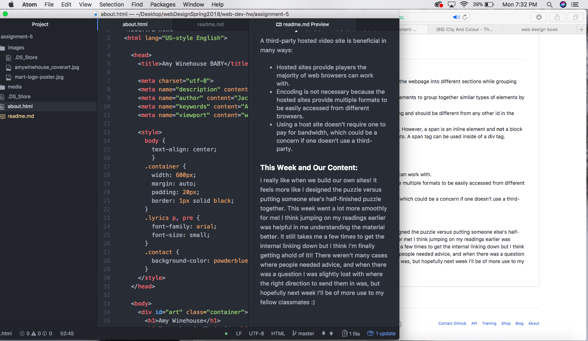

# Artist Page

#### Working with divs, classes, ids and spans:

- divs: a block element and a container unit which separates the webpage into different sections while grouping together HTML and CSS to different page elements.
- class: the class attribute is an identifier for certain HTML elements to group together similar types of elements by a naming id.
- id: a unique identifier for an HTM element to help with styling and should be different from any other id in the document.
- spans: similar to a div tag, a span is mostly used for styling. However, a span is an inline element and **not** a block element, meaning it is on the same line as the other elements. A span tag can be used inside of a div tag.

#### Third Party vs. Self-Hosted Media:

A third-party hosted video site is beneficial in many ways:

- Hosted sites provide players the majority of web browsers can work with.
- Encoding is not necessary because the hosted sites provide multiple formats to be easily accessed from different browsers.
- Using a host site doesn't require one to pay for bandwidth, which could be a concern if one doesn't use a third-party.

#### This Week and Our Content:

I really like when we build our own sites! It feels more like I designed the puzzle versus putting someone else's half-finished puzzle together. This week went a lot more smoothly for me! I think jumping on my readings earlier was helpful in me understanding the material better. It still takes me a few times to get the internal linking down but I think I'm finally getting ahold of it!! There weren't many cases where people needed advice, and when there was a question I was slightly lost with where the right direction to send them in was, but hopefully next week I'll be of more use to my fellow classmates :)

