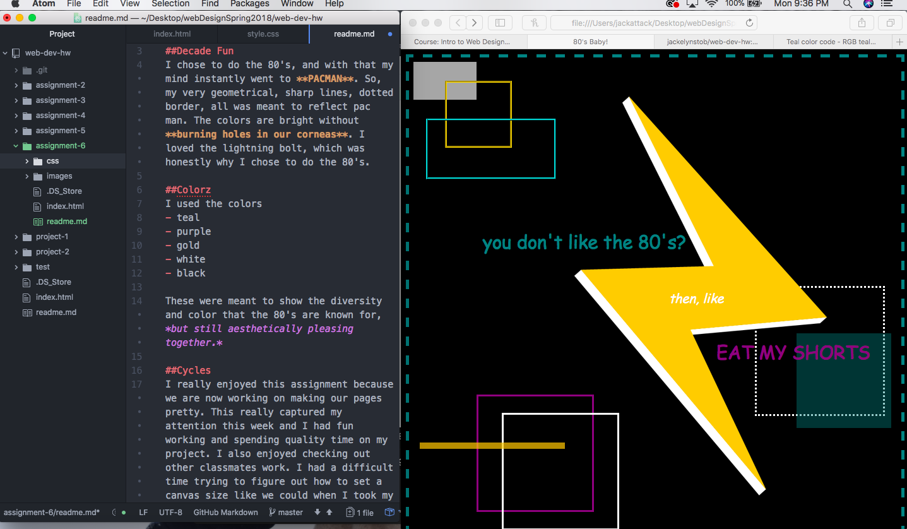

# CSS (Cool, Stimulating, Schoolwork)

## Decade Fun
I chose to do the 80's, and with that my mind instantly went to **PACMAN**. So, my very geometrical, sharp lines, dotted border, all was meant to reflect pac man. The colors are bright without **burning holes in our corneas**. I loved the lightning bolt, which was honestly why I chose to do the 80's.

## Colorz
I used the colors
- teal
- purple
- gold
- white
- black

These were meant to show the diversity and color that the 80's are known for, *but still aesthetically pleasing together.*

## Cycles
I really enjoyed this assignment because we are now working on making our pages pretty. This really captured my attention this week and I had fun working and spending quality time on my project. I also enjoyed checking out other classmates work. I had a difficult time trying to figure out how to set a canvas size like we could when I took my creative coding class, so I just set up the document to look nice if the screen was 800x800 (which I think is what we were supposed to do.)

