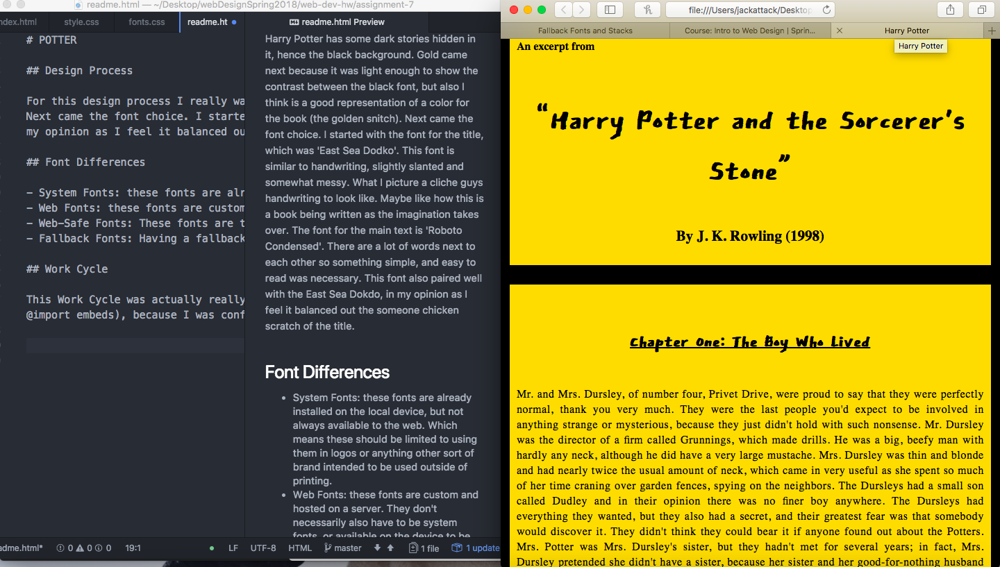

# POTTER

## Design Process

For this design process I really wanted to keep it simple. I kept the title of the book separate from the first chapter for clarity. There were beginning to be too many "headers" in one area, so I broke it up. Next came the colors. Harry Potter has some dark stories hidden in it, hence the black background. Gold came next because it was light enough to show the contrast between the black font, but also I think is a good representation of a color for the book (the golden snitch).
Next came the font choice. I started with the font for the title, which was 'East Sea Dodko'. This font is similar to handwriting, slightly slanted and somewhat messy. What I picture a cliche guys handwriting to look like. Maybe like how this is a book being written as the imagination takes over. The font for the main text is 'Roboto Condensed'. There are a lot of words next to each other so something simple, and easy to read was necessary. This font also paired well with the East Sea Dokdo, in my opinion as I feel it balanced out the someone chicken scratch of the title.

## Font Differences

- System Fonts: these fonts are already installed on the local device, but not always available to the web. Which means these should be limited to using them in logos or anything other sort of brand intended to be used outside of printing.
- Web Fonts: these fonts are custom and hosted on a server. They don't necessarily also have to be system fonts, or available on the device to be seen, but requires a few extra elements to make sure we can see them how they were intended.
- Web-Safe Fonts: These fonts are those that are 'known' to be available by the system. This allows the load time to decrease and performance to increase. Both Mac and Windows have access to these fonts.
- Fallback Fonts: Having a fallback font is incredibly important, because if the intended font isn't available on the user's device. This means it will call upon the next listed font, until the computer is able to load one. Making sure the fonts all have a point to being picked is important, as fallback fonts will most likely be seen by somebody, and the overall aesthetic should be maintained.

## Work Cycle

This Work Cycle was actually really fun. I let myself work over the concept and idea for a bit before I just rushed into it. As I was working on my project on the last night, my neice and nephew needed to be watched, so I panicked that I wouldn't be able to finish my project to how I would have liked it to be, but I'm extremely happy with what I ended up with. I didn't run into any hardships really, other than I think I used all of the ways to use fonts (downloading, standard embeds, and @import embeds), because I was confused there. It's better to be safe than sorry haha! Other than that what went well was setting up the project, connecting my files to each other, and finding a font I was happy with!! I hadn't been able to help anyone on GitHub simply because I wasn't sure the right answers for their questions.

