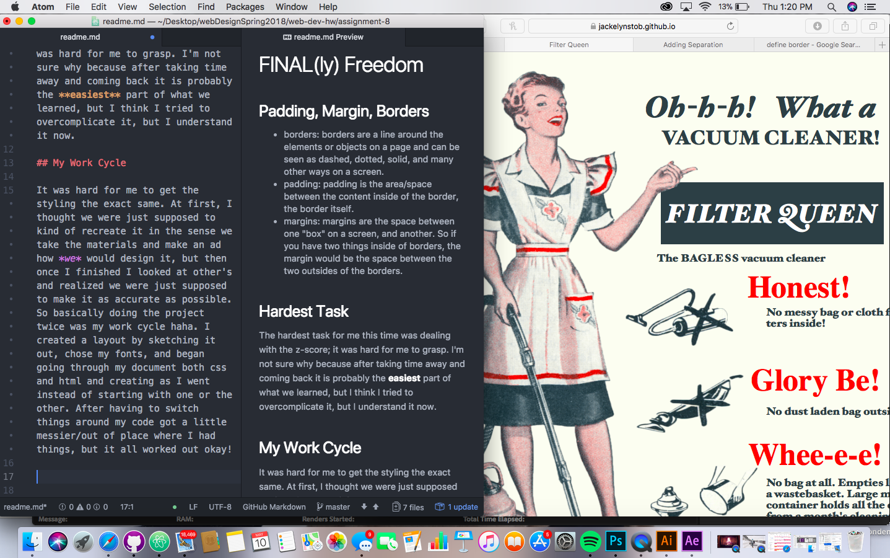

# FINAL(ly) Freedom

## Padding, Margin, Borders

- borders: borders are a line around the elements or objects on a page and can be seen as dashed, dotted, solid, and many other ways on a screen.
- padding: padding is the area/space between the content inside of the border, the border itself.
- margins: margins are the space between one "box" on a screen, and another. So if you have two things inside of borders, the margin would be the space between the two outsides of the borders.

## Hardest Task

The hardest task for me this time was dealing with the z-score; it was hard for me to grasp. I'm not sure why because after taking time away and coming back it is probably the **easiest** part of what we learned, but I think I tried to overcomplicate it, but I understand it now.

## My Work Cycle

It was hard for me to get the styling the exact same. At first, I thought we were just supposed to kind of recreate it in the sense we take the materials and make an ad how *we* would design it, but then once I finished I looked at other's and realized we were just supposed to make it as accurate as possible. So basically doing the project twice was my work cycle haha. I created a layout by sketching it out, chose my fonts, and began going through my document both css and html and creating as I went instead of starting with one or the other. After having to switch things around my code got a little messier/out of place where I had things, but it all worked out okay!

