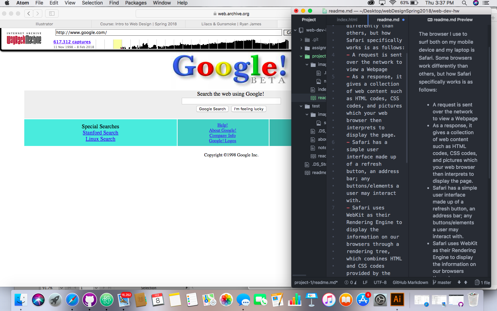
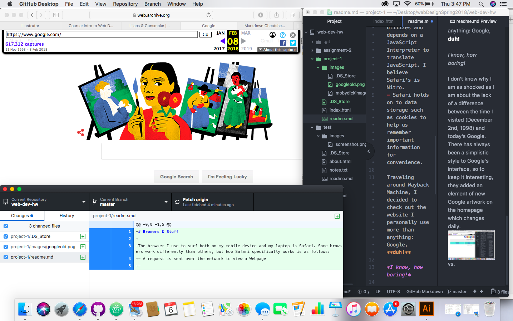

# Project 1 Shenanigans | Jack Stob

## Browsers & Stuff
The browser I use to surf both on my mobile device and my laptop is Safari. Some browser's logistics work differently than others, but how Safari specifically works is as follows:
- Safari has a simple user interface made up of a refresh button, an address bar; any buttons/elements a user may interact with.
- To view the webpage, a request is sent over the network from the browser.
- As a response, the network gives a collection of web content such as HTML codes, CSS codes, and pictures which your web browser then interprets to display the page.
- Safari uses WebKit as their Rendering Engine to display the information on our browsers from a rendering tree, which combines the HTML and CSS codes provided by the network.
- Safari utilizes and depends on a JavaScript Interpreter to translate JavaScript. I believe Safari's is Nitro.
- Safari holds on to data storage such as cookies to help us remember important information for convenience.  

## We go like, *way* back
Traveling around Wayback Machine, I decided to check out the website I personally use more than anything: Google, **duh!**

*I know, how boring!*

I don't know why I am as shocked as I am about the lack of a difference between the time I visited (December 2nd, 1998) and today's Google. There has always been a simplistic style to Google's interface, so to keep it interesting, they added an element of new Google artwork on the homepage which changes daily.

vs.

## Worky Work
This week's content and homework was slightly weird for me. I went through the course work on Tuesday, so not everything had been uploaded yet (as in the interactive activities), and moodle's week 3 hadn't been released yet. So when I received the email that it *had* been updated, I was a little lost because I attempted to do the assignment before fully going through the course work on the course website (even though I thought I had LOL). Anyway, once I got realized *that*, the other stuff came fairly naturally. The instructions were clear and easy to follow, so for that I am super grateful! The webpage I built this week we were supposed to use a poem, but instead I used the beginning of Moby Dick. I chose this instead because it is considered one of the best opening liners for a book, and also because it is so beautifully written it *sounds like a poem to me*. Also I designed it how I felt I would like it to be set up: all of the lines that aren't tabbed are lines I underlined when I read it because I either loved the way they sounded, or they made me giggle.

I luckily didn't have any bumps in the road for myself, and in terms of helping classmates, **@missellejane** said:
*"Anytime I try to publish my repository and push it to GitHub, it tells me there is an "Authorization Error" and tells me to log in to GitHub, even though I am clearly logged in.
Not sure what to do.
Please help!"*
and I repsonded with: *
"Did you go correctly connect your repo to your GitHub Desktop App? If you click on the link it brings you to those directions on how to, maybe double check to make sure it's connected correctly." (and provided the link for her).*
Who knows if that's the issue but that was the only thing I could think of!!!
**All in all this was a successful week (in my opinion) and I'm excited for what's to come! **
