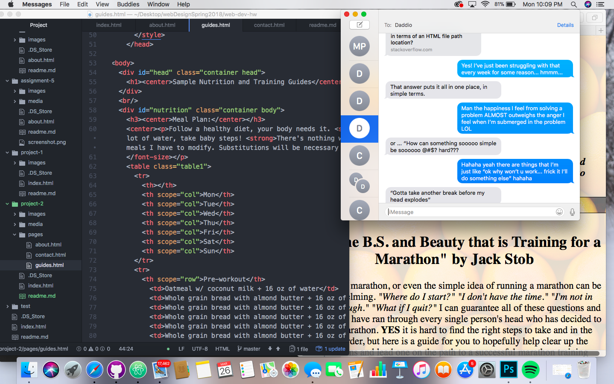

# First Official Webpage

## HTML
I new *some* about HTML, but not everything. Simple things like
- syntax,
- semantic markup,
- lists,

and other things like that. But what was new for me was the majority of what we learned! 
- Images,
- videos,
- audio,
- google maps (so iframes),
- navigation elements,
- id's,
- divs,
- etc.

it was all new and all delivered to us in a way that was easy to understand. The most difficult part of HTML for me is internal hyperlinks, but I feel I'm finally getting the hang of it.

## CSS
I'm very excited to begin CSS as I know pretty much nothing about it (or at least I think I don't), but what I do know is it expands styling, and that it was I'm really stoked for. Adding our own flare and meat to the bones that is html will add a new element to my knowledge I didn't before. I like design and this is where I get to use my creativity more! I just hope it isn't too much of a learning curve.

## Work Cycle
I actually spent quite a bit of time on this project (obviously, but more than I thought I needed.) Even down to the backgrounds of my pages I put a lot of effort into these. I did a lot of research going through pictures to find the right ones, editing them in photoshop and making sure they looked well with the others. I did **a lot** of review over the technical things in HTML which was actually kind of fun. Coming up with a topic was easy, I've been wanting to blog about my marathon training anyway, but doing it in a way that satisfied the assignment criteria was a bit challenging at first. I spent a ton of time trying to figure out how to have two divs in line with each other (figured out the float command), and even after I got that, the spacing between those and the next div was difficult to figure out. Also adding pictures NEXT to text I spent at least 2 hours on. My submit button on my contact page as well was extremely small on the page for a very long time, but after awhile it got bigger and I truly have no idea how I figured that one out. All-in-all there were little things that turned out to be long adventures and big things that came easily. The tables alone took me FOREVER while the almost the entire contact page was finished relatively quickly. All-in-all I'm really happy with what I came up with.

## 'Gotta Take Another Break Before My Head Explodes'

